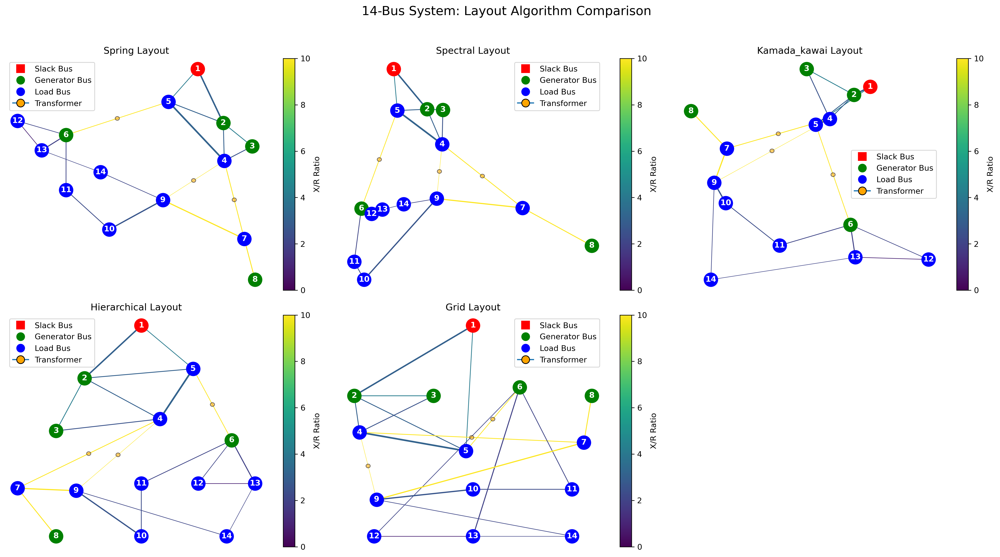

# Power System Analysis Library

A comprehensive Python implementation of power system analysis tools, featuring multiple power flow methods (Newton-Raphson, Gauss-Seidel, Fast Decoupled, Power Perturbation), economic dispatch optimization, B-coefficient calculations, and network visualization. Based on Prof. Hadi Saadat's MATLAB/Octave code, this is a pure Python implementation without using pandapower, making it lightweight and self-contained.

## Overview

This library provides tools for power system analysis, including:

- Power flow analysis using multiple methods:
  - Newton-Raphson method
  - Gauss-Seidel method
  - Fast Decoupled method
  - Power Perturbation method
- Line flow and loss calculations
- B-coefficient loss formula calculation
- Economic dispatch of generation
- Visualization of power system networks with multiple layout options

## Installation

1. Clone this repository:
   ```bash
   git clone https://github.com/chmdznr/power-system-analysis.git
   cd power-system-analysis
   ```

2. Install dependencies:
   ```bash
   pip install -r requirements.txt
   ```

## Usage

### Basic Example

```python
import numpy as np
from src.power_system import PowerSystem

# Create a power system instance
ps = PowerSystem()

# Set parameters
ps.basemva = 100.0
ps.accuracy = 0.001
ps.maxiter = 10

# Load example data (5-bus system)
# Bus Bus  Voltage Angle   ---Load---- -------Generator----- Injected
# No  code Mag.    Degree  MW    Mvar  MW  Mvar Qmin Qmax     Mvar
busdata = [
    [1, 1, 1.06, 0.0, 0, 0, 0, 0, 10, 50, 0],
    [2, 2, 1.045, 0.0, 20, 10, 40, 30, 10, 50, 0],
    [3, 2, 1.03, 0.0, 20, 15, 30, 10, 10, 40, 0],
    [4, 0, 1.00, 0.0, 50, 30, 0, 0, 0, 0, 0],
    [5, 0, 1.00, 0.0, 60, 40, 0, 0, 0, 0, 0]
]

# Bus bus   R      X     1/2 B   Line code
# nl  nr  p.u.   p.u.   p.u.     = 1 for lines, > 1 or < 1 tr. tap at bus nl
linedata = [
    [1, 2, 0.02, 0.06, 0.030, 1],
    [1, 3, 0.08, 0.24, 0.025, 1],
    [2, 3, 0.06, 0.18, 0.020, 1],
    [2, 4, 0.06, 0.18, 0.020, 1],
    [2, 5, 0.04, 0.12, 0.015, 1],
    [3, 4, 0.01, 0.03, 0.010, 1],
    [4, 5, 0.08, 0.24, 0.025, 1]
]

# Load the data
ps.load_data(busdata, linedata)

# Run power flow analysis
ps.lfybus()  # Form bus admittance matrix
ps.lfnewton()  # Run Newton-Raphson power flow

# Print power flow results
ps.busout()
```

### Economic Dispatch Example

```python
# Calculate B loss coefficients
B, B0, B00 = ps.bloss()

# Define cost coefficients for generators (alpha, beta, gamma)
cost = np.array([
    [200, 7.0, 0.008],  # Generator 1
    [180, 6.3, 0.009],  # Generator 2
    [140, 6.8, 0.007]   # Generator 3
])

# Define generator limits
mwlimits = np.array([
    [10, 85],   # Generator 1 min, max
    [10, 80],   # Generator 2 min, max
    [10, 70]    # Generator 3 min, max
])

# Run economic dispatch
Pgg, lambda_, PL = ps.dispatch(Pdt=150.0, cost=cost, mwlimits=mwlimits)

# Calculate total cost
totalcost = ps.gencost(Pgg, cost)
```

### Visualization Example

```python
from src.power_viz import plot_power_system
from src.power_position import get_system_positions
import matplotlib.pyplot as plt

# Get positions for the power system
pos = get_system_positions(ps, layout_type='spring')

# Create visualization
ax = plot_power_system(ps, node_positions=pos, show_values=True)

# Show the plot
plt.show()
```



## Module Structure

- `src/power_system.py`: Main power system class with core functionality
- `src/power_viz.py`: Visualization utilities for power system networks
- `src/power_position.py`: Network layout algorithms for visualization
- `examples/`: Directory containing example scripts
  - Power Flow Analysis:
    - `chapter6_ex11.py`: IEEE 30-bus system with Newton-Raphson method
    - `chapter6_ex13.py`: IEEE 30-bus system with Fast Decoupled method
    - `chapter6_ex15.py`: IEEE 30-bus system with Power Perturbation method
  - Economic Dispatch:
    - `chapter7_ex9.py`: Example of B-coefficient calculation
    - `chapter7_ex10.py`: Example of economic dispatch with losses
    - `chapter7_ex11.py`: 26-bus system economic dispatch optimization
    - `economic_dispatch.py`: Test cases for economic dispatch algorithms
  - Visualization:
    - `ps_layout_demonstration.py`: Demonstration of different network layouts

> **Note**: This is a pure Python implementation without using the `pandapower` package, making it lightweight and self-contained.

## Bus Data Format

The bus data is a matrix with the following columns:
1. Bus number
2. Bus type (1=slack, 2=PV, 0=PQ)
3. Voltage magnitude (pu)
4. Voltage angle (degrees)
5. Load real power, Pd (MW)
6. Load reactive power, Qd (Mvar)
7. Generation real power, Pg (MW)
8. Generation reactive power, Qg (Mvar)
9. Minimum reactive power limit, Qmin (Mvar)
10. Maximum reactive power limit, Qmax (Mvar)
11. Shunt admittance, Qsh (Mvar at V=1.0 pu)

## Line Data Format

The line data is a matrix with the following columns:
1. From bus number
2. To bus number
3. Resistance, R (pu)
4. Reactance, X (pu)
5. Line charging susceptance, B/2 (pu)
6. Transformer tap ratio (1.0 for lines)

## Cost Function Format

The cost data is a matrix with the following columns for each generator:
1. Alpha coefficient ($/h)
2. Beta coefficient ($/MWh)
3. Gamma coefficient ($/MW²h)

## License

This software is licensed under MIT license.

## Acknowledgments

- Prof. Hadi Saadat for the original MATLAB/Octave code
- IEEE for the test systems data