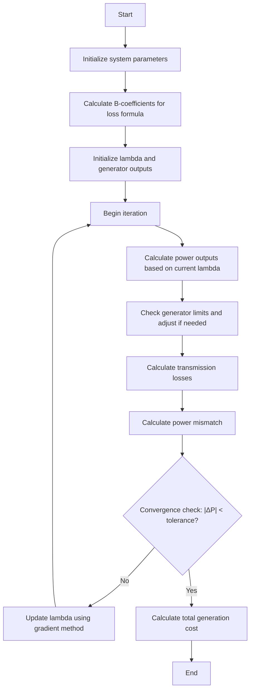
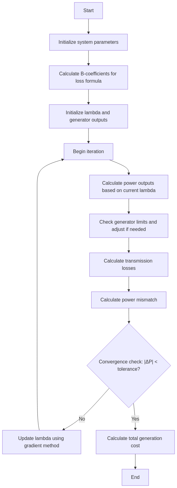

# Economic Dispatch with Loss Coefficients

## Overview

Economic dispatch is a key optimization problem in power system operation that determines the optimal output of electricity generators to meet the system load at the lowest possible cost, subject to transmission and operational constraints. The implementation in this library includes B-coefficient loss formulas to account for transmission losses in the optimization process.

## Mathematical Foundation

The economic dispatch problem aims to minimize the total generation cost while satisfying the power balance constraint and generator limits.

### Objective Function

The total generation cost is given by:

```
Cost = Σ(α_i + β_i*P_i + γ_i*P_i²) for i=1 to n
```

Where:
- α_i, β_i, γ_i are the cost coefficients for generator i
- P_i is the power output of generator i
- n is the number of generators

### Constraints

1. **Power Balance Constraint**:
   ```
   Σ P_i = P_D + P_L for i=1 to n
   ```
   Where:
   - P_D is the total system demand
   - P_L is the total transmission loss

2. **Generator Limits**:
   ```
   P_i,min ≤ P_i ≤ P_i,max for i=1 to n
   ```

### Transmission Loss Formula

The transmission losses are calculated using B-coefficients:

```
P_L = Σ Σ P_i * B_ij * P_j + Σ B_0i * P_i + B_00 for i,j=1 to n
```

Where:
- B_ij, B_0i, B_00 are the loss coefficients
- P_i, P_j are generator outputs

## Algorithm Implementation



<!--  -->

## Implementation Details

The economic dispatch algorithm is implemented in the `dispatch()` method of the `PowerSystem` class. Here's a breakdown of the key steps:

1. **Initialization**:
   - Set up cost coefficients and generator limits
   - Initialize lambda (incremental cost) and generator outputs
   - Scale B-coefficients for per-unit calculations

2. **Iteration Process**:
   - Calculate generator outputs based on current lambda
   - Check and enforce generator limits
   - Calculate transmission losses using B-coefficients
   - Calculate power mismatch (demand + losses - generation)
   - Update lambda using gradient method
   - Check for convergence

3. **Final Calculations**:
   - Calculate total generation cost
   - Update generation schedule in the power system model

## Code Excerpt

```python
def dispatch(self, Pdt=None, cost=None, mwlimits=None):
    """Economic dispatch using B coefficients for losses"""
    # Initialization
    # ...
    
    # Scaled B coefficients
    Bu = self.B / self.basemva
    B00u = self.basemva * self.B00
    
    # Cost function coefficients
    alpha = cost[:, 0]
    beta = cost[:, 1]
    gama = cost[:, 2]
    
    # Generator limits
    Pmin = mwlimits[:, 0]
    Pmax = mwlimits[:, 1]
    
    # Newton-Raphson iteration
    while abs(DelP) >= 0.0001 and iterp < 200:
        iterp += 1
        
        # Form E matrix and Dx vector
        E = np.copy(Bu)  # Reset E for each iteration
        Dx = np.zeros(ngg)
        
        for k in range(ngg):
            if wgt[k] == 1:  # Active generator
                E[k, k] = gama[k] / lambda_ + Bu[k, k]
                Dx[k] = 0.5 * (1 - self.B0[k] - beta[k] / lambda_)
            else:  # Generator at limit
                E[k, k] = 1
                Dx[k] = 0
                
                for m in range(ngg):
                    if m != k:
                        E[k, m] = 0
        
        # Solve for power generation
        PP = np.linalg.solve(E, Dx)
        
        # Update generation and calculate losses
        # ...
        
        # Calculate residual and update lambda
        # ...
```

## Advantages and Limitations

### Advantages
- Accounts for transmission losses in the optimization
- Handles generator limits properly
- Uses efficient gradient-based lambda updates
- Provides optimal generation schedule to minimize cost

### Limitations
- Requires pre-calculated B-coefficients
- Assumes quadratic cost functions
- May have convergence issues for complex systems
- Does not consider network constraints directly

## Usage Example

```python
# Create a power system instance
ps = PowerSystem()

# Load system data and run power flow
ps.load_data(busdata, linedata)
ps.lfybus()
ps.lfnewton()

# Calculate B-coefficients for losses
B, B0, B00 = ps.bloss()

# Define cost coefficients for generators (alpha, beta, gamma)
cost = np.array([
    [200, 7.0, 0.008],  # Generator 1
    [180, 6.3, 0.009],  # Generator 2
    [140, 6.8, 0.007]   # Generator 3
])

# Define generator limits
mwlimits = np.array([
    [10, 85],   # Generator 1 min, max
    [10, 80],   # Generator 2 min, max
    [10, 70]    # Generator 3 min, max
])

# Run economic dispatch
Pgg, lambda_, PL = ps.dispatch(Pdt=150.0, cost=cost, mwlimits=mwlimits)

# Calculate total cost
totalcost = ps.gencost(Pgg, cost)
```