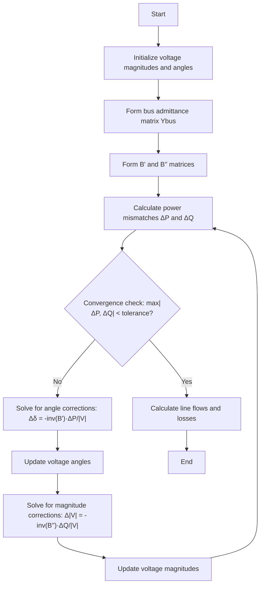
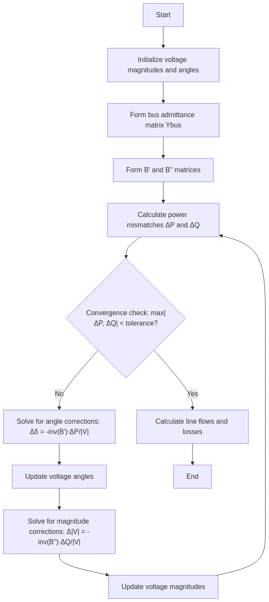

# Fast Decoupled Power Flow Method

## Overview

The Fast Decoupled power flow method is an efficient technique for solving power flow problems in electrical power systems. It is a simplified version of the Newton-Raphson method that takes advantage of the weak coupling between active power and voltage magnitude, and between reactive power and voltage angle in transmission systems. This decoupling significantly reduces computational requirements while maintaining good convergence properties for most practical power systems.

## Mathematical Foundation

The Fast Decoupled method is based on two key simplifications of the Newton-Raphson method:

1. The coupling between active power and voltage magnitude (∂P/∂|V|) and between reactive power and voltage angle (∂Q/∂δ) is neglected.
2. The Jacobian matrix elements are simplified and kept constant during iterations.

### Decoupled Power Flow Equations

The standard Newton-Raphson power flow equations are decoupled into two separate sets:

```
[ΔP/|V|] = [B'] [Δδ]
[ΔQ/|V|] = [B"] [Δ|V|]
```

Where:
- ΔP and ΔQ are the active and reactive power mismatches
- Δδ and Δ|V| are the voltage angle and magnitude corrections
- B' and B" are constant matrices derived from the bus admittance matrix

## Algorithm Implementation



<!--  -->

## Implementation Details

The Fast Decoupled power flow method is implemented in the `decouple()` method of the `PowerSystem` class. Here's a breakdown of the key steps:

1. **Initialization**:
   - Set up arrays for bus voltages, angles, and power values
   - Process bus data to determine bus types (slack, PV, PQ)

2. **Matrix Formation**:
   - Form the B' matrix for non-slack buses (PV and PQ)
   - Form the B" matrix for PQ buses only
   - Invert these matrices (done only once)

3. **Iteration Process**:
   - Calculate power mismatches at each bus
   - Normalize mismatches by voltage magnitude
   - Solve for angle corrections using B' matrix
   - Update voltage angles
   - Solve for magnitude corrections using B" matrix
   - Update voltage magnitudes for PQ buses
   - Check for convergence

4. **Handling Generator Reactive Power Limits**:
   - For PV buses, check if reactive power limits are violated
   - Adjust voltage magnitudes if necessary

## Code Excerpt

```python
def decouple(self):
    """Power flow solution by Fast Decoupled method"""
    # Initialization and bus data processing
    # ...
    
    # Create matrices of appropriate size
    B1 = np.zeros((n_nonsw, n_nonsw))  # B' matrix for non-slack buses
    B2 = np.zeros((n_pq, n_pq))        # B" matrix for PQ buses only
    
    # Fill B1 and B2 matrices
    # ...
    
    # Invert matrices (done only once)
    B1inv = np.linalg.inv(B1)
    B2inv = np.linalg.inv(B2)
    
    # Start iterations
    while self.maxerror >= accuracy and self.iter <= maxiter:
        # Calculate mismatches
        # ...
        
        # Solve for angle and voltage corrections
        Dd = -np.matmul(B1inv, DPV)  # Angle corrections
        DV = -np.matmul(B2inv, DQV)  # Voltage magnitude corrections
        
        # Apply corrections
        # ...
        
        # Calculate maximum error
        self.maxerror = np.max([np.max(np.abs(DP)), np.max(np.abs(DQ))])
```

## Advantages and Limitations

### Advantages
- Faster computation per iteration compared to Newton-Raphson
- Constant Jacobian matrices that need to be inverted only once
- Good convergence for most practical power systems
- Memory efficient for large systems

### Limitations
- Slower convergence rate compared to Newton-Raphson
- May have convergence issues for heavily loaded systems
- Not suitable for systems with high R/X ratios
- Performance degrades for ill-conditioned systems

## Usage Example

```python
# Create a power system instance
ps = PowerSystem()

# Set parameters
ps.basemva = 100.0
ps.accuracy = 0.001
ps.maxiter = 20

# Load bus and line data
ps.load_data(busdata, linedata)

# Form the bus admittance matrix
ps.lfybus()

# Run Fast Decoupled power flow
ps.decouple()

# Print results
ps.busout()
```

## References

1. B. Stott and O. Alsac, "Fast Decoupled Load Flow," IEEE Transactions on Power Apparatus and Systems, vol. PAS-93, no. 3, pp. 859-869, 1974.
2. Hadi Saadat, "Power System Analysis," McGraw-Hill, 1999.
3. J. Grainger and W. Stevenson, "Power System Analysis," McGraw-Hill, 1994.