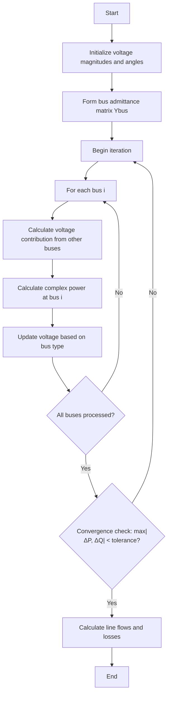

# Gauss-Seidel Power Flow Method

## Overview

The Gauss-Seidel method is an iterative technique for solving power flow problems in electrical power systems. It is one of the classical approaches for power flow analysis, known for its simplicity and straightforward implementation. While it may require more iterations to converge compared to Newton-Raphson, it has lower computational requirements per iteration.

## Mathematical Foundation

The Gauss-Seidel method for power flow analysis is based on iteratively updating voltage magnitudes and angles at each bus using the power flow equations.

### Power Flow Equations

For each bus in the power system, the complex power is given by:

```
S_i = P_i + jQ_i = V_i * sum(Y_ij * V_j)* for j=1 to n
```

Where:
- S_i is the complex power at bus i
- P_i is the real power at bus i
- Q_i is the reactive power at bus i
- V_i is the complex voltage at bus i
- Y_ij is the (i,j) element of the bus admittance matrix
- n is the number of buses

### Voltage Update Equation

The Gauss-Seidel method rearranges the power flow equation to solve for the voltage at each bus:

```
V_i = 1/Y_ii * [(P_i - jQ_i)/V_i* - sum(Y_ij * V_j) for j=1 to n, j≠i]
```

For PV (generator) buses, the voltage magnitude is kept constant while the angle is updated to maintain the specified real power output.

## Algorithm Implementation



<!--  -->

## Implementation Details

The Gauss-Seidel power flow method is implemented in the `lfgauss()` method of the `PowerSystem` class. Here's a breakdown of the key steps:

1. **Initialization**:
   - Set up arrays for bus voltages, angles, and power values
   - Process bus data to determine bus types (slack, PV, PQ)
   - Initialize voltage values for all buses

2. **Iteration Process**:
   - For each bus, calculate the voltage contribution from all connected buses
   - Calculate complex power at the bus
   - Calculate power mismatches
   - Update voltage based on bus type:
     - For PQ buses: update both magnitude and angle
     - For PV buses: maintain specified voltage magnitude, update angle
     - For slack buses: maintain specified voltage magnitude and angle
   - Check for convergence based on power mismatches

3. **Handling Generator Reactive Power Limits**:
   - For PV buses, check if reactive power limits are violated
   - Adjust voltage magnitudes if necessary

4. **Acceleration Factor**:
   - Use an acceleration factor to improve convergence speed
   - Typical values range from 1.3 to 1.8

## Code Excerpt

```python
def lfgauss(self):
    """Power flow solution by Gauss-Seidel method"""
    # Initialization
    # ...
    
    # Set default parameters if not already set
    accel = getattr(self, 'accel', 1.3)  # Acceleration factor
    
    # Start iteration
    self.iter = 0
    self.maxerror = 10
    
    while self.maxerror >= accuracy and self.iter <= maxiter:
        self.iter += 1
        
        for n in range(nbus_int):
            YV = 0 + 0j
            
            # Calculate voltage contribution from connected buses
            for L in range(self.nbr):
                if self.nl[L] - 1 == n:
                    k = self.nr[L] - 1
                    YV += self.Ybus[n, k] * self.V[k]
                elif self.nr[L] - 1 == n:
                    k = self.nl[L] - 1
                    YV += self.Ybus[n, k] * self.V[k]
            
            # Calculate complex power
            Sc[n] = np.conj(self.V[n]) * (self.Ybus[n, n] * self.V[n] + YV)
            Sc[n] = np.conj(Sc[n])
            
            # Calculate power mismatches
            DP[n] = self.P[n] - np.real(Sc[n])
            DQ[n] = self.Q[n] - np.imag(Sc[n])
            
            # Update voltage based on bus type
            # ...
            
            # Apply acceleration factor
            self.V[n] += accel * (Vc[n] - self.V[n])
```

## Advantages and Limitations

### Advantages
- Simple implementation
- Lower computational requirements per iteration
- Good for small to medium-sized systems
- Works well with well-conditioned systems

### Limitations
- Slower convergence compared to Newton-Raphson
- May require more iterations for larger systems
- Convergence not guaranteed for ill-conditioned systems
- Sensitive to initial conditions

## Usage Example

```python
# Create a power system instance
ps = PowerSystem()

# Set parameters
ps.basemva = 100.0
ps.accuracy = 0.001
ps.maxiter = 100
ps.accel = 1.8  # Acceleration factor

# Load bus and line data
ps.load_data(busdata, linedata)

# Form the bus admittance matrix
ps.lfybus()

# Run Gauss-Seidel power flow
ps.lfgauss()

# Print results
ps.busout()
```
