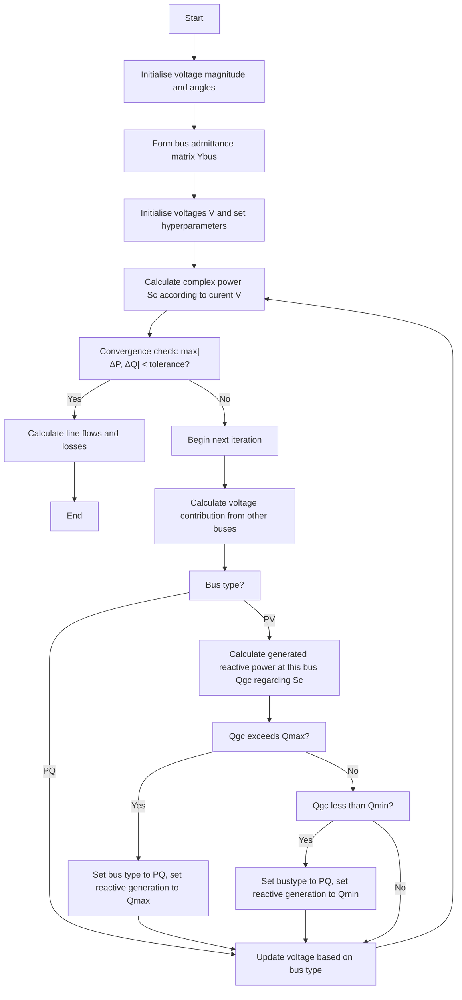
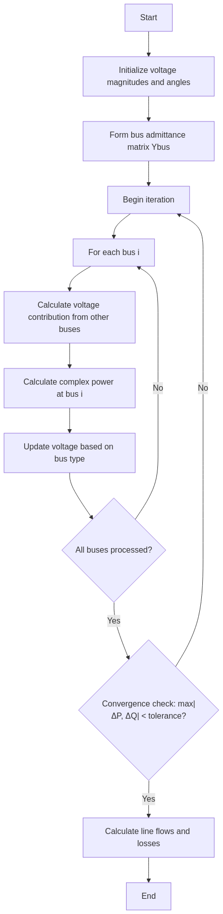

# Gauss-Seidel Power Flow Method

The Gauss-Seidel method is an iterative technique for solving power flow problems in electrical power systems. It is one of the classical approaches for power flow analysis, known for its simplicity and straightforward implementation. While it may require more iterations to converge compared to Newton-Raphson, it has lower computational requirements per iteration.

## Mathematical Foundation

The Gauss-Seidel method is an iterative technique used to solve a system of linear equations. It is named after the German mathematicians Carl Friedrich Gauss and Philipp Ludwig von Seidel. This method is particularly useful for large systems where direct methods like Gaussian elimination are computationally expensive. It operates by sequentially updating each variable using the most recent values available, effectively reformulating each equation to isolate the target variable. Starting from an initial guess, the method proceeds iteratively, refining the solution until convergence is achieved.
Mathematically, the iteration can be expressed as:

\[
f(x) = 0 \rightarrow x^{(k+1)} = g(x^{k}) \quad \text{until} \quad |x^{(k+1)} - x^{k}| < \epsilon
\]

where $x^{(k)}$ denotes the approximation at iteration k, and $\epsilon$ is a predefined tolerance threshold.

### Power Flow Equations

For each bus in the power system, the complex power is given by:

\[
S_i = P_i + j Q_i = V_i  (\sum_{j=1}^{n} Y_{ij} V_j)^*
\]

Where:
- $S_i$ is the complex power at bus $i$
- $P_i$ is the real power at bus $i$
- $Q_i$ is the reactive power at bus $i$
- $V_i$ is the complex voltage at bus $i$
- $Y_{ij}$ is the (i,j) element of the bus admittance matrix
- $n$ is the number of buses

It is a common practice to distinct power contribution from other buses and the target bus, itself.
\[
S_i = P_i + j Q_i = |V_i|^2 Y_{ii} + V_i (\sum_{\substack{j=1 \\ j \ne i}}^{n} Y_{ij} V_j)
\]

### Voltage Update Equation

The Gauss-Seidel method rearranges the power flow equation to solve for the voltage at each bus:

\[
V_i = \frac{1}{Y_{ii}} (\frac{P_i - jQ_i}{V_i^*} - \sum_{\substack{j=1 \\ j \ne i}}^{n} Y_{ij} V_j)
\]

Similar to power equations, the term with summation in the quation above is known as voltage contribution from other buses.


For PV (generator) buses, the voltage magnitude is kept constant while the angle is updated to maintain the specified real power output unless reactive generation boundries are violated.

## Algorithm Implementation




<!--  -->

## Implementation Details

The Gauss-Seidel power flow method is implemented in the `lfgauss()` method of the `PowerSystem` class. Here's a breakdown of the key steps:

1. **Initialization**:
   - Set up arrays for bus voltages, angles, and power values
   - Process bus data to determine bus types (slack, PV, PQ)
   - Initialize voltage values for all buses

2. **Iteration Process**:
    - Calculate complex power at the bus
    
    - For each bus, calculate the voltage contribution from all connected buses
    - Update voltage based on bus type:
        - For PQ buses: update both magnitude and angle
        - For PV buses: maintain specified voltage magnitude, update angle
        - For slack buses: maintain specified voltage magnitude and angle
    - Calculate power mismatches
    - Check for convergence based on power mismatches

3. **Handling Generator Reactive Power Limits**:
   - For PV buses, check if reactive power limits are violated
   - Set bus type to PQ in this case
   - Calculate Qbus by setting Qg to Qmax or Qmin 

4. **Acceleration Factor**:
   - Use an acceleration factor to improve convergence speed
   - Typical values range from 1.3 to 1.8

## Code Excerpt

```python
def lfgauss(self):
    """Power flow solution by Gauss-Seidel method"""
    # Initialization
    # ...
    
    # Set default parameters if not already set
    accel = getattr(self, 'accel', 1.3)  # Acceleration factor
    
    # Start iteration
    self.iter = 0
    self.maxerror = 10
    
    while self.maxerror >= accuracy and self.iter <= maxiter:
        self.iter += 1
        
        for n in range(nbus_int):
            YV = 0 + 0j
            # Calculate voltage contribution from other buses
            elm_Y = np.delete(self.Ybus[n, :], n)
            YV = np.dot(elm_Y, np.transpose(np.delete(self.V, n)))
            
            # Calculate complex power
            Sc[n] = np.conj(self.V[n]) * (self.Ybus[n, n] * self.V[n] + YV)
            Sc[n] = np.conj(Sc[n])
            
            # Calculate power mismatches
            DP[n] = self.P[n] - np.real(Sc[n])
            DQ[n] = self.Q[n] - np.imag(Sc[n])

            # Ensure that generated reactive power on PV buses are within the limits
            # If not, turn them to PQ buses

            if Qgc <= self.Qmin[n]:
                # If maximum reactive power should be generated,
                # nth bust changes to PQ bus from this iteration forward
                self.Q[n] = (
                    self.Qmin[n] + self.Qsh[n] - self.Qd[n]
                ) / self.basemva
                self.kb[n] = 0

            elif Qgc >= self.Qmax[n]:
                # If minimum reactive power shoul be generated,
                # nth bust changes to PQ bus from this iteration forward
                self.Q[n] = (
                    self.Qmax[n] + self.Qsh[n] - self.Qd[n]
                ) / self.basemva
                self.kb[n] = 0

            # Update voltage based on bus type
            # ...
            
            # Apply acceleration factor
            self.V[n] += accel * (Vc[n] - self.V[n])
```

## Advantages and Limitations

### Advantages
- Simple implementation
- Lower computational requirements per iteration
- Good for small to medium-sized systems
- Works well with well-conditioned systems

### Limitations
- Slower convergence compared to Newton-Raphson
- May require more iterations for larger systems
- Convergence not guaranteed for ill-conditioned systems
- Sensitive to initial conditions

## Usage Example

```python
# Create a power system instance
ps = PowerSystem()

# Set parameters
ps.basemva = 100.0
ps.accuracy = 0.001
ps.maxiter = 100
ps.accel = 1.8  # Acceleration factor

# Load bus and line data
ps.load_data(busdata, linedata)

# Form the bus admittance matrix
ps.lfybus()

# Run Gauss-Seidel power flow
ps.lfgauss()

# Print results
ps.busout()
```
