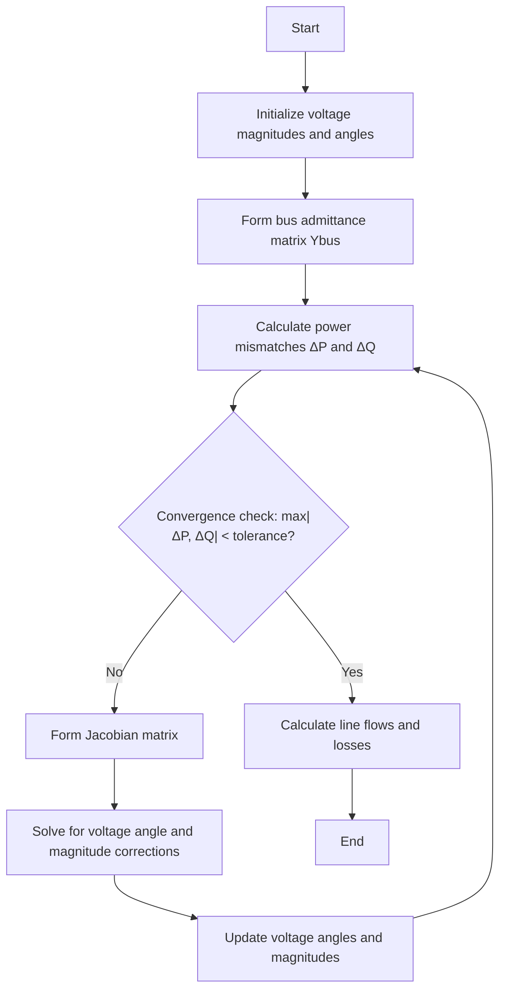

# Newton-Raphson Power Flow Method

## Overview

The Newton-Raphson method is one of the most widely used numerical techniques for solving power flow problems in electrical power systems. It is known for its quadratic convergence characteristics, which means it converges to a solution much faster than other methods like Gauss-Seidel, especially for larger systems.

## Mathematical Foundation

The Newton-Raphson method is an iterative numerical technique used to find the roots of a real-valued function. It is particularly effective for solving equations numerically and is known for its quadratic convergence, meaning it converges quickly to the root when the initial guess is close to the actual root.

### Power Flow Equations

For each bus in the power system, we have the following complex power equations:

\[
S_i = P_i + jQ_i = V_i  (\sum_{j=1}^{n} Y_ij * V_j)*
\]

Where:
- $S_i$ is the complex power at bus $i$
- $P_i$ is the real power at bus $i$
- $Q_i$ is the reactive power at bus $i$
- $V_i$ is the complex voltage at bus $i$
- $Y_{ij}$ is the ($i$,$j$) element of the bus admittance matrix
- $n$ is the number of buses

It is possible to write the active and reactive powers in each bus as a function of voltage magnitudes and angles.
\[
S^*_i = P_i - j Q_i = V_i^* I_i = |V_i| \angle -\delta_i \sum_{j=1}^n |Y_{ij}| |V_j| \angle (\theta_{ij}+\delta_j)
\]

\[
\Rightarrow
\begin{cases}
   P_i = \sum_{j=1}^n |V_i| |V_j| |Y_{ij}| \cos{(\theta_{ij} - \delta_i + \delta_j)} \\
   \\
   Q_i = - \sum_{j=1}^n |V_i| |V_j| |Y_{ij}| \sin{(\theta_{ij} - \delta_i + \delta_j)}
\end{cases}
\]

Writing the active and reactive power equations in this form facilitates the application of the Newton-Raphson method for solving them.

### Jacobian Matrix

The Newton-Raphson method uses a Jacobian matrix to linearize the power flow equations. The Jacobian matrix consists of partial derivatives of the power equations with respect to the voltage angles and magnitudes.
\[
   \begin{bmatrix}
   \Delta P \\  
   \Delta Q  
   \end{bmatrix} =
   \begin{bmatrix} J1 & J2 \\ J3 & J4  \end{bmatrix}
   \begin{bmatrix}
   \Delta \delta \\
   \Delta |V| 
   \end{bmatrix}
\]

where
\[
\begin{matrix} 
J1 = \frac{\partial P}{\partial \delta} & J2 = \frac{\partial P}{\partial |V|} \\
 & \\
J3 = \frac{\partial Q}{\partial \delta} & J4 = \frac{\partial Q}{\partial |V|} 
\end{matrix}
\]

Adhering to the predefined shapes of matrices is essential.
- \( J1 : (N^{PQ}+ N^{PV}) \times (N^{PQ}+N^{PV}) \)
- \( J2 : (N^{PQ} + N^{PV}) \times (N^{PQ}) \)
- \( J3 : (N^{PQ}) \times (N^{PQ} + N^{PV}) \)
- \( J4 : (N^{PQ}) \times (N^{PQ}) \)

where \(N^{PQ}\) is the number of PQ buses and \(N^{PV}\) is the number of PV buses. Keep in mind that \(n = N^{PQ} + N^{PV} + 1\)

## Algorithm Implementation



## Implementation Details

The Newton-Raphson power flow method is implemented in the `lfnewton()` method of the `PowerSystem` class. Here's a breakdown of the key steps:

1. **Initialization**:
   - Set up arrays for bus voltages, angles, and power values
   - Process bus data to determine bus types (slack, PV, PQ)

2. **Iteration Process**:
   - Form the Jacobian matrix
   - Solve the linear system to find voltage corrections
   - Update voltage magnitudes and angles
   - Calculate power mismatches at each bus
   - Check for convergence

3. **Forming the Jacobian matrix**
   - Calculate off-diagonal elements setting diagonal elements to zero
   - For J1 and J3 diagonal elements are detrmined as the summation and negation of the row containing the diagonal element.
   - For J2 and J4 diagonal elements determined as the summation of the column containing the element and an extra term.
   - Remove the column and row that represents the slack variable from J1 to J4
   - Remove the column and row that represents the PV buses from J2, J3 and J4 according to their final shape

4. **Handling Generator Reactive Power Limits**:
   - For PV buses, check if reactive power limits are violated
   - If upper limit is violated, set reactive generation of bus to maximum value and change bus type to PQ
   - If lower limit is violated, set reactive generation of bus to minimum value and change bus type to PQ 

5. **Final Calculations**:
   - Update complex voltages and power values
   - Calculate system totals

## Code Excerpt

```python
def lfnewton(self):
    """Power flow solution by Newton-Raphson method"""
    # Initialization
    ns = 0  # Number of slack buses
    ng = 0  # Number of generator (PV) buses
    self.Vm = zeros(int(self.nbus))
    self.delta = zeros(int(self.nbus))
    
    # Process bus data and set up initial values
    # ...
    
    # Start of iterations
    while self.maxerror >= self.accuracy and self.iter <= self.maxiter:
        # Build Jacobian matrix and compute mismatches
        # ...
        
        # Solve for the correction vector
        DX = np.linalg.solve(A, DC)
        
        # Update voltage angle and magnitude
        # ...
        
        # Calculate maximum error
        self.maxerror = max(abs(DC))
```

## Advantages and Limitations

### Advantages
- Fast convergence (quadratic convergence rate)
- Reliable for most well-conditioned power systems
- Handles large systems efficiently

### Limitations
- Requires a good initial estimate for convergence
- Computationally intensive for very large systems
- May have convergence issues for ill-conditioned systems

## Usage Example

```python
# Create a power system instance
ps = PowerSystem()

# Set parameters
ps.basemva = 100.0
ps.accuracy = 0.001
ps.maxiter = 10

# Load bus and line data
ps.load_data(busdata, linedata)

# Form the bus admittance matrix
ps.lfybus()

# Run Newton-Raphson power flow
ps.lfnewton()

# Print results
ps.busout()
```