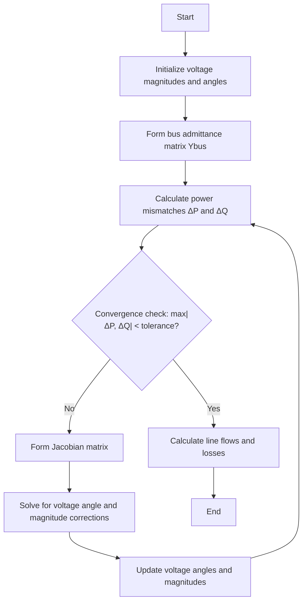
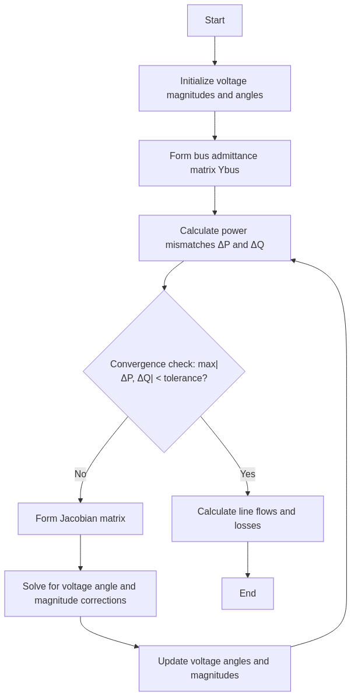

# Newton-Raphson Power Flow Method

## Overview

The Newton-Raphson method is one of the most widely used numerical techniques for solving power flow problems in electrical power systems. It is known for its quadratic convergence characteristics, which means it converges to a solution much faster than other methods like Gauss-Seidel, especially for larger systems.

## Mathematical Foundation

The Newton-Raphson method for power flow analysis is based on linearizing the nonlinear power flow equations using Taylor series expansion and iteratively solving for the voltage magnitudes and angles until convergence is achieved.

### Power Flow Equations

For each bus in the power system, we have the following complex power equations:

```
S_i = P_i + jQ_i = V_i * sum(Y_ij * V_j)* for j=1 to n
```

Where:
- S_i is the complex power at bus i
- P_i is the real power at bus i
- Q_i is the reactive power at bus i
- V_i is the complex voltage at bus i
- Y_ij is the (i,j) element of the bus admittance matrix
- n is the number of buses

### Jacobian Matrix

The Newton-Raphson method uses a Jacobian matrix to linearize the power flow equations. The Jacobian matrix consists of partial derivatives of the power equations with respect to the voltage angles and magnitudes.

```
[ΔP/Δδ  ΔP/Δ|V|]
[ΔQ/Δδ  ΔQ/Δ|V|]
```

## Algorithm Implementation



<!--  -->

## Implementation Details

The Newton-Raphson power flow method is implemented in the `lfnewton()` method of the `PowerSystem` class. Here's a breakdown of the key steps:

1. **Initialization**:
   - Set up arrays for bus voltages, angles, and power values
   - Process bus data to determine bus types (slack, PV, PQ)

2. **Iteration Process**:
   - Calculate power mismatches at each bus
   - Form the Jacobian matrix
   - Solve the linear system to find voltage corrections
   - Update voltage magnitudes and angles
   - Check for convergence

3. **Handling Generator Reactive Power Limits**:
   - For PV buses, check if reactive power limits are violated
   - Adjust voltage magnitudes if necessary

4. **Final Calculations**:
   - Update complex voltages and power values
   - Calculate system totals

## Code Excerpt

```python
def lfnewton(self):
    """Power flow solution by Newton-Raphson method"""
    # Initialization
    ns = 0  # Number of slack buses
    ng = 0  # Number of generator (PV) buses
    self.Vm = zeros(int(self.nbus))
    self.delta = zeros(int(self.nbus))
    
    # Process bus data and set up initial values
    # ...
    
    # Start of iterations
    while self.maxerror >= self.accuracy and self.iter <= self.maxiter:
        # Build Jacobian matrix and compute mismatches
        # ...
        
        # Solve for the correction vector
        DX = np.linalg.solve(A, DC)
        
        # Update voltage angle and magnitude
        # ...
        
        # Calculate maximum error
        self.maxerror = max(abs(DC))
```

## Advantages and Limitations

### Advantages
- Fast convergence (quadratic convergence rate)
- Reliable for most well-conditioned power systems
- Handles large systems efficiently

### Limitations
- Requires a good initial estimate for convergence
- Computationally intensive for very large systems
- May have convergence issues for ill-conditioned systems

## Usage Example

```python
# Create a power system instance
ps = PowerSystem()

# Set parameters
ps.basemva = 100.0
ps.accuracy = 0.001
ps.maxiter = 10

# Load bus and line data
ps.load_data(busdata, linedata)

# Form the bus admittance matrix
ps.lfybus()

# Run Newton-Raphson power flow
ps.lfnewton()

# Print results
ps.busout()
```