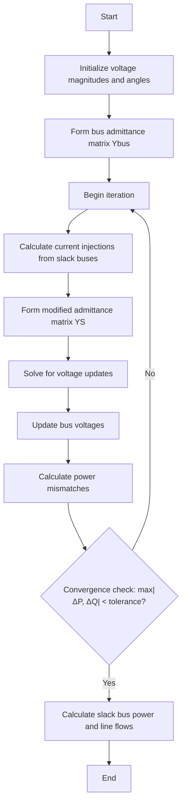
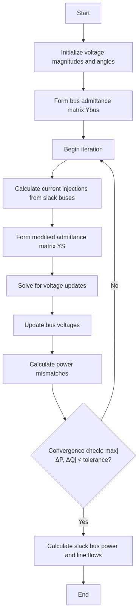

# Power Perturbation Method for Power Flow Analysis

## Overview

The Power Perturbation method is an alternative approach to solving power flow problems in electrical power systems. Unlike the Newton-Raphson and Fast Decoupled methods that focus on voltage corrections, this technique directly perturbs the power injections to achieve convergence. It offers a different mathematical formulation that can be advantageous in certain system conditions.

## Mathematical Foundation

The Power Perturbation method is based on the principle of linearizing the power flow equations around the current operating point and using the sensitivity of voltages to power injections to update the system state.

### Power Flow Equations

The method starts with the standard power flow equations:

$$
S_i = V_i  (\sum_{j=1}^{n} Y_ij  V_j)* 
$$

Where:
- $S_i$ is the complex power at bus $i$
- $V_i$ is the complex voltage at bus $i$
- $Y_{ij}$ is the ($i$,$j$) element of the bus admittance matrix
- $n$ is the number of buses

### Perturbation Approach

The Power Perturbation method reformulates the problem by:

1. Expressing the bus admittance equation in terms of current injections
2. Incorporating the power balance equations into the admittance matrix
3. Solving for voltage updates directly

The key equation becomes:

$$
Y_s  V = I
$$

Where:
- $Y_s$ is a modified admittance matrix that includes power injection terms
- $V$ is the vector of bus voltages
- $I$ is a vector of current injections from slack buses

## Algorithm Implementation



<!--  -->

## Implementation Details

The Power Perturbation method is implemented in the `perturbation()` method of the `PowerSystem` class. Here's a breakdown of the key steps:

1. **Initialization**:
   - Set up arrays for bus voltages, angles, and power values
   - Process bus data to determine bus types (slack, PV, PQ)

2. **Matrix Formation**:
   - Form the standard bus admittance matrix
   - Create a modified admittance matrix (YS) for non-slack buses

3. **Iteration Process**:
   - Calculate current injections from connections to slack buses
   - Update the diagonal elements of YS with power injection terms
   - Solve the system of equations for voltage updates
   - Update bus voltages and calculate power mismatches
   - Check for convergence

4. **Final Calculations**:
   - Calculate slack bus power
   - Update all system values

## Code Excerpt

```python
def perturbation(self):
    """Power Flow Solution by the Power Perturbation Technique."""
    # Initialization
    # ...
    
    # Create Y1 matrix for non-slack buses
    Y1 = np.zeros((ii+1, ii+1), dtype=complex)
    
    # Fill Y1 matrix
    # ...
    
    # Copy to YS for modification during iterations
    YS = Y1.copy()
    
    # Initialize I array for iteration
    I = np.zeros(ii+1, dtype=complex)
    
    # Iteration loop
    while maxerror >= self.accuracy and self.iter <= self.maxiter:
        self.iter += 1
        
        # Calculate injections from slack buses
        for n in range(1, nbus+1):
            nn = n - nss[n]
            if kb[n] != 1:  # Not a swing bus
                I[nn] = 0
                
                # Find connections to swing buses
                for i in range(len(self.nl)):
                    nl_i = self.nl[i]
                    nr_i = self.nr[i]
                    if nl_i == n or nr_i == n:
                        if nl_i == n:
                            l = nr_i
                        else:
                            l = nl_i
                        
                        if kb[l] == 1:  # Connected to swing bus
                            I[nn] = I[nn] - self.Ybus[n-1, l-1] * V[l]
                
                # Update YS diagonal with power injection term
                YS[nn, nn] = Y1[nn, nn] - np.conj(S[n]) / (Vm[n]**2)
        
        # Solve system for voltage updates
        A1 = YS[1:ii+1, 1:ii+1]
        Vk = np.linalg.solve(A1, I[1:ii+1])
        
        # Update voltages and powers
        # ...
```

## Advantages and Limitations

### Advantages
- Different mathematical approach that can work when other methods fail
- Can handle certain ill-conditioned systems better than traditional methods
- Directly incorporates power injections into the solution process
- May converge in cases where Newton-Raphson diverges

### Limitations
- Less commonly used than Newton-Raphson or Fast Decoupled methods
- May require more iterations for some systems
- Performance depends on system characteristics
- Less documented in power system literature

## Usage Example

```python
# Create a power system instance
ps = PowerSystem()

# Set parameters
ps.basemva = 100.0
ps.accuracy = 0.001
ps.maxiter = 12

# Load bus and line data
ps.load_data(busdata, linedata)

# Form the bus admittance matrix
ps.lfybus()

# Run Power Perturbation power flow
ps.perturbation()

# Print results
ps.busout()
```